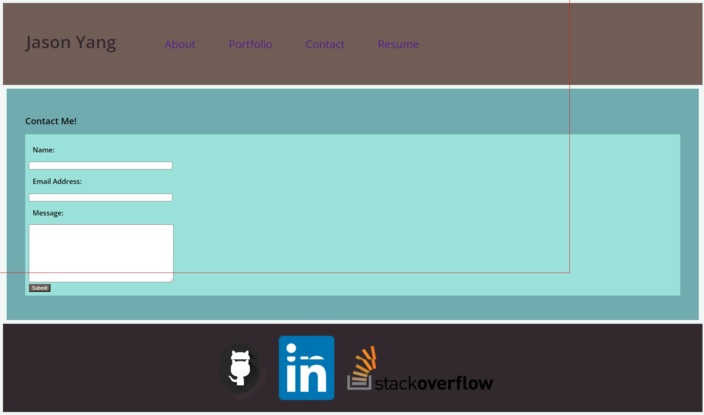
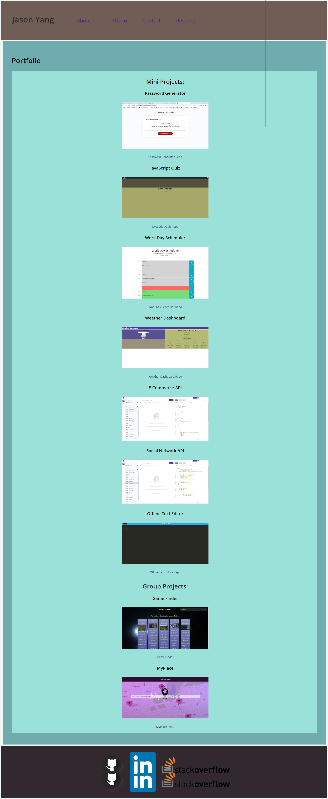
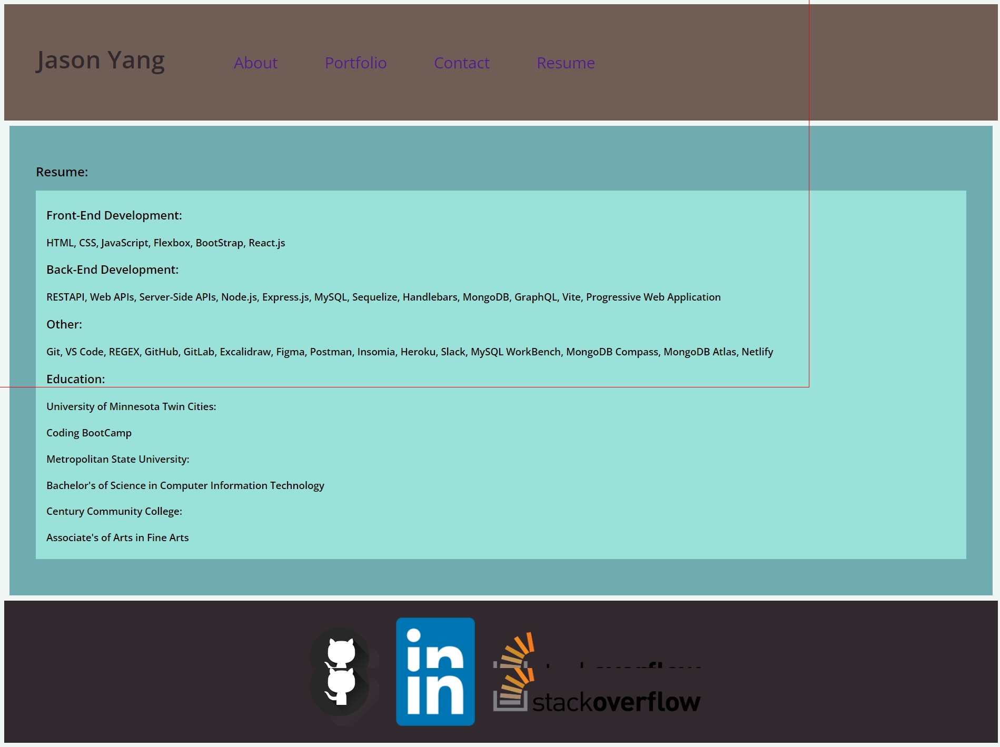

# Personal Portfolio React

## Description

My motivation is to create a personal portfolio to list my skills and experiences.
I build this project to have a personal portfolio to use for web development.
This solve the problem to help me get employed.
I learn that I have improve my html and css skills.

## Table of Contents

If your README is long, add a table of contents to make it easy for users to find what they need.

- [Installation](#installation)
- [Usage](#usage)
- [Credits](#credits)
- [License](#license)
- [Badges](#badges)
- [Features](#features)
- [HowToContribute](#how-to-contribute)
- [Tests](#tests)

## Installation

What are the steps required to install your project? Provide a step-by-step description of how to get the development environment running.

1. Download the zipped or clone the Git Repo.
2. Open the folder through VS code.
3. Type in 'npm run dev'

## Usage

Contact Page

Portfolio Page

Contact Page

Resume Page

## Credits

Collaborator:

1. Sichoun Nplhaib Lee: https://github.com/DDXP3

Sources:

1. https://www.w3schools.com/react/react_css.asp
2. https://www.w3schools.com/css/css_colors_hex.asp
3. https://www.w3schools.com/react/react_css_styling.asp
4. https://www.cleanpng.com/png-computer-icons-logo-portable-network-graphics-clip-6362014/
5. https://upload.wikimedia.org/wikipedia/commons/thumb/c/ca/LinkedIn_logo_initials.png/128px-LinkedIn_logo_initials.png
6. https://fonts.google.com/specimen/Open+Sans
7. https://coolors.co/user/palettes
8. https://upload.wikimedia.org/wikipedia/commons/f/f7/Stack_Overflow_logo.png
9. https://stackoverflow.com/questions/42065348/center-a-tag-in-div
10. https://www.w3schools.com/tags/tag_a.asp
11. https://www.w3schools.com/tags/tag_img.asp
12. https://www.w3schools.com/tags/tag_textarea.asp
13. https://fonts.google.com/specimen/Hedvig+Letters+Serif

## License

There is no license used.

## Badges

There is no badges.

## Features

Features include about me, portfolio, contact, and resume.

## How to Contribute

There is no need to contribute.

## Tests

There is no need to test.